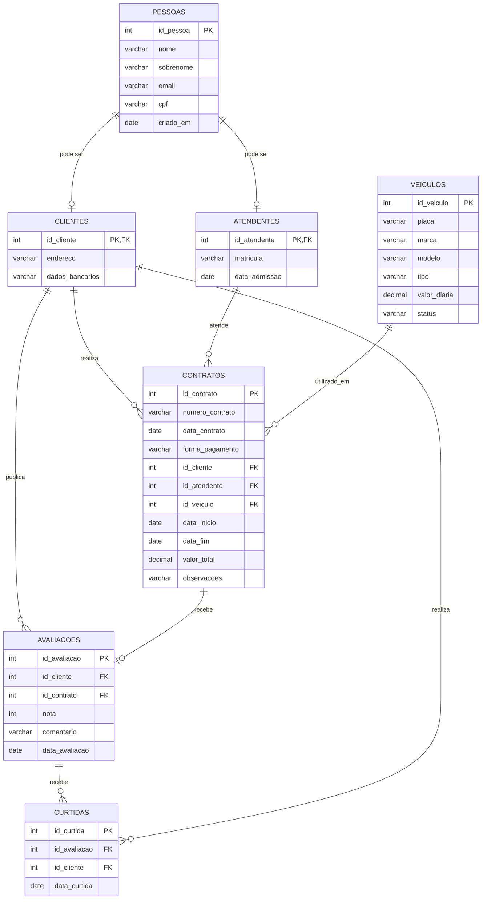

# 🚗 Sistema de Aluguel de Carros

Sistema desenvolvido como projeto acadêmico para gerenciamento de uma empresa de aluguel de carros.

O sistema permite o cadastro de pessoas, clientes, atendentes e veículos, além do gerenciamento dos contratos de aluguel. Como proposta de inovação, foi adicionada uma funcionalidade de **Interações Sociais**, permitindo que clientes compartilhem suas experiências por meio de avaliações e comentários e que outros clientes possam curtir essas publicações.

---

## 📌 Sobre o projeto

O sistema foi desenvolvido para organizar o processo de aluguel de veículos, desde o cadastro dos envolvidos até o registro dos contratos.

Além das funcionalidades básicas de um sistema de aluguel de carros, foi implementada uma proposta de inovação baseada em **Interações Sociais**.

A ideia é permitir que, após realizar um aluguel, o cliente possa:

* ⭐ Dar uma nota de 1 a 5;
* 💬 Escrever um comentário sobre sua experiência;
* 📢 Publicar sua avaliação;
* 👍 Curtir avaliações publicadas por outros clientes;
* 👀 Visualizar as experiências de outros usuários.

Dessa forma, o sistema deixa de ser apenas uma ferramenta para registrar aluguéis e passa a permitir uma interação simples entre os clientes.

---

# 🎯 Objetivos

## Objetivo geral

Desenvolver um sistema de gerenciamento de aluguel de carros, adicionando uma funcionalidade de interação social entre os clientes.

## Objetivos específicos

* Cadastrar pessoas no sistema;
* Identificar clientes e atendentes;
* Cadastrar veículos;
* Registrar contratos de aluguel;
* Relacionar clientes aos seus aluguéis;
* Permitir que clientes avaliem suas experiências;
* Permitir a publicação de comentários;
* Permitir curtidas nas avaliações;
* Exibir as avaliações em formato de feed;
* Impedir que um cliente curta a mesma avaliação mais de uma vez.

---

# 👥 Principais entidades

| Entidade       | Descrição                                                 |
| -------------- | --------------------------------------------------------- |
| **Pessoas**    | Armazena os dados básicos das pessoas cadastradas         |
| **Clientes**   | Representa as pessoas que podem realizar aluguéis         |
| **Atendentes** | Representa os funcionários responsáveis pelo atendimento  |
| **Veículos**   | Armazena os veículos disponíveis para aluguel             |
| **Contratos**  | Registra os aluguéis realizados                           |
| **Avaliações** | Armazena as notas e comentários publicados pelos clientes |
| **Curtidas**   | Registra as interações dos clientes com as avaliações     |

---

# 🗄️ Modelo do banco de dados

O banco utiliza o PostgreSQL.

A estrutura principal do sistema pode ser representada da seguinte forma:



---

# 📋 Tabelas do banco

## Pessoas

| Campo       | Tipo    | Descrição               |
| ----------- | ------- | ----------------------- |
| `id_pessoa` | SERIAL  | Identificador da pessoa |
| `nome`      | VARCHAR | Nome                    |
| `sobrenome` | VARCHAR | Sobrenome               |
| `email`     | VARCHAR | E-mail                  |
| `cpf`       | VARCHAR | CPF                     |
| `criado_em` | DATE    | Data de cadastro        |

---

## Clientes

| Campo             | Tipo    | Descrição                |
| ----------------- | ------- | ------------------------ |
| `id_cliente`      | INT     | Identificador do cliente |
| `endereco`        | VARCHAR | Endereço                 |
| `dados_bancarios` | VARCHAR | Dados bancários          |

A tabela `clientes` utiliza o mesmo identificador da pessoa cadastrada em `pessoas`.

---

## Atendentes

| Campo           | Tipo    | Descrição                  |
| --------------- | ------- | -------------------------- |
| `id_atendente`  | INT     | Identificador do atendente |
| `matricula`     | VARCHAR | Matrícula do funcionário   |
| `data_admissao` | DATE    | Data de admissão           |

---

## Veículos

| Campo          | Tipo    | Descrição                 |
| -------------- | ------- | ------------------------- |
| `id_veiculo`   | SERIAL  | Identificador do veículo  |
| `placa`        | VARCHAR | Placa                     |
| `marca`        | VARCHAR | Marca                     |
| `modelo`       | VARCHAR | Modelo                    |
| `tipo`         | VARCHAR | Tipo do veículo           |
| `valor_diaria` | NUMERIC | Valor da diária           |
| `status`       | VARCHAR | Situação atual do veículo |

Os tipos de veículo considerados são:

* `MOTO`
* `CAMINHAO`
* `CARRO_PASSEIO`

Os possíveis status são:

* `DISPONIVEL`
* `ALUGADO`
* `MANUTENCAO`

---

## Contratos

A tabela `contratos` representa os aluguéis realizados pelos clientes.

| Campo             | Tipo    | Descrição                 |
| ----------------- | ------- | ------------------------- |
| `id_contrato`     | SERIAL  | Identificador do contrato |
| `numero_contrato` | VARCHAR | Número do contrato        |
| `data_contrato`   | DATE    | Data do contrato          |
| `forma_pagamento` | VARCHAR | Forma de pagamento        |
| `id_cliente`      | INT     | Cliente responsável       |
| `id_atendente`    | INT     | Atendente responsável     |
| `id_veiculo`      | INT     | Veículo alugado           |
| `data_inicio`     | DATE    | Início do aluguel         |
| `data_fim`        | DATE    | Final do aluguel          |
| `valor_total`     | NUMERIC | Valor total               |
| `observacoes`     | VARCHAR | Observações               |

---

# ⭐ Proposta de Inovação — Interações Sociais

A proposta escolhida para o projeto foi **Interações Sociais**.

A funcionalidade foi pensada para permitir que os clientes compartilhem suas experiências depois de realizar um aluguel.

O cliente pode criar uma publicação contendo uma nota e um comentário. Outros clientes podem visualizar essa publicação e demonstrar interesse por meio de curtidas.

### Fluxo da interação

```text
Cliente realiza um aluguel
          ↓
    Aluguel é concluído
          ↓
Cliente pode avaliar
          ↓
Escolhe uma nota de 1 a 5
          ↓
Escreve um comentário
          ↓
       PUBLICA
          ↓
Avaliação aparece no feed
          ↓
Outros clientes podem CURTIR
```

---

# 💬 Tabela de Avaliações

A tabela `avaliacoes` é responsável por armazenar as publicações feitas pelos clientes.

| Campo            | Tipo         | Descrição                    |
| ---------------- | ------------ | ---------------------------- |
| `id_avaliacao`   | SERIAL       | Identificador da avaliação   |
| `id_cliente`     | INT          | Cliente que publicou         |
| `id_contrato`    | INT          | Aluguel relacionado          |
| `nota`           | INT          | Nota de 1 a 5                |
| `comentario`     | VARCHAR(500) | Texto publicado pelo cliente |
| `data_avaliacao` | DATE         | Data da publicação           |

### Regras

A nota precisa estar entre **1 e 5**.

Cada contrato pode receber apenas uma avaliação.

Exemplo:

```text
Marina Souza
⭐⭐⭐⭐⭐

"Carro excelente e muito confortável!"

👍 12 curtidas
```

---

# 👍 Tabela de Curtidas

A tabela `curtidas` registra quando um cliente curte uma avaliação.

| Campo          | Tipo   | Descrição                |
| -------------- | ------ | ------------------------ |
| `id_curtida`   | SERIAL | Identificador da curtida |
| `id_avaliacao` | INT    | Avaliação curtida        |
| `id_cliente`   | INT    | Cliente que curtiu       |
| `data_curtida` | DATE   | Data da curtida          |

Existe uma restrição para impedir que o mesmo cliente curta a mesma publicação mais de uma vez.

```text
Cliente A
   │
   └── 👍 Avaliação 1

Cliente A
   │
   └── 👍 Avaliação 1 novamente

        ❌ Não permitido
```

---

# 📱 Protótipo da interface

Além do banco de dados, foi desenvolvido um protótipo de interface para representar como a funcionalidade poderia ser utilizada por um cliente.

A interface simula um pequeno feed de avaliações.

### Feed

```text
┌─────────────────────────────────────────┐
│             ALUGA FÁCIL                 │
├─────────────────────────────────────────┤
│                                         │
│  ⭐ Avaliações dos clientes             │
│                                         │
│  Marina Souza                            │
│  ⭐⭐⭐⭐⭐                                 │
│                                         │
│  "Carro excelente e muito confortável!" │
│                                         │
│  👍 12 curtidas       ❤️ Curtir         │
│                                         │
├─────────────────────────────────────────┤
│                                         │
│  Ricardo Lima                            │
│  ⭐⭐⭐⭐                                  │
│                                         │
│  "Boa experiência, o veículo estava     │
│   em ótimo estado."                      │
│                                         │
│  👍 8 curtidas        ❤️ Curtir         │
│                                         │
│             + Publicar avaliação        │
│                                         │
└─────────────────────────────────────────┘
```

---

# ✍️ Publicar avaliação

O usuário também possui uma área para criar uma nova publicação.

```text
┌─────────────────────────────────────────┐
│           PUBLICAR AVALIAÇÃO             │
├─────────────────────────────────────────┤
│                                         │
│  Nome                                    │
│  [ Seu nome________________________ ]    │
│                                         │
│  Aluguel                                 │
│  [ Selecione o aluguel_____________ ]   │
│                                         │
│  Nota                                     │
│  ☆ ☆ ☆ ☆ ☆                               │
│                                         │
│  Comentário                               │
│  ┌─────────────────────────────────────┐ │
│  │ Conte como foi sua experiência...   │ │
│  │                                     │ │
│  └─────────────────────────────────────┘ │
│                                         │
│             [ PUBLICAR ]                 │
│                                         │
└─────────────────────────────────────────┘
```

No protótipo, ao preencher os dados e selecionar **Publicar**, a avaliação aparece no feed.

O usuário também pode utilizar o botão de **Curtir** nas publicações.

---

# 🔄 Funcionamento da interação

O funcionamento proposto para o usuário é:

### 1. Cadastro

O usuário é cadastrado no sistema como uma pessoa e pode possuir o papel de cliente.

### 2. Aluguel

O cliente realiza um aluguel através de um contrato.

### 3. Avaliação

Depois do aluguel, o cliente pode acessar a área de avaliações.

### 4. Publicação

O cliente escolhe a quantidade de estrelas e escreve um comentário.

### 5. Feed

A publicação aparece para os demais usuários.

### 6. Curtida

Outros clientes podem clicar em **Curtir**.

### 7. Banco de dados

Cada ação é representada por registros nas tabelas `avaliacoes` e `curtidas`.

---

# 🧪 Exemplos de dados

### Avaliações

| Cliente         | Veículo             |  Nota | Comentário                                          |
| --------------- | ------------------- | ----: | --------------------------------------------------- |
| Marina Souza    | Fiat Argo           | ⭐⭐⭐⭐⭐ | Carro excelente e muito confortável!                |
| Ricardo Lima    | Honda CG 160        |  ⭐⭐⭐⭐ | Boa experiência, o veículo estava em ótimo estado.  |
| Fernanda Alves  | Volkswagen Gol      | ⭐⭐⭐⭐⭐ | Gostei muito do atendimento e do veículo.           |
| Juliana Pereira | Mercedes Accelo 815 |  ⭐⭐⭐⭐ | O veículo atendeu muito bem às minhas necessidades. |

### Curtidas

| Avaliação       | Cliente que curtiu |
| --------------- | ------------------ |
| Marina Souza    | Ricardo Lima       |
| Marina Souza    | Fernanda Alves     |
| Ricardo Lima    | Marina Souza       |
| Fernanda Alves  | Juliana Pereira    |
| Juliana Pereira | Marina Souza       |

---

# 🛠️ Tecnologias utilizadas

| Tecnologia     | Utilização                            |
| -------------- | ------------------------------------- |
| **PostgreSQL** | Banco de dados                        |
| **SQL**        | Criação e manipulação das tabelas     |
| **pgAdmin**    | Administração e testes do banco       |
| **HTML**       | Estrutura do protótipo                |
| **CSS**        | Estilização da interface              |
| **JavaScript** | Interações do protótipo               |
| **GitHub**     | Versionamento e publicação do projeto |
| **Mermaid**    | Representação do modelo do banco      |

---

# 📁 Estrutura sugerida do projeto

```text
aluguel-de-carros/
│
├── README.md
│
├── sql/
│   └── banco_aluguel_carros.sql
│
└── prototipo/
    └── index.html
```

O arquivo SQL contém a estrutura do banco, os dados de teste e as funcionalidades relacionadas às avaliações e curtidas.

O arquivo `index.html` representa o protótipo da interface de interação social.

---

# 🚀 Como executar o banco

### 1. Abrir o pgAdmin

Abra o PostgreSQL através do pgAdmin.

### 2. Criar ou selecionar um banco de dados

Selecione o banco onde o projeto será executado.

### 3. Abrir o Query Tool

Abra o **Query Tool** do pgAdmin.

### 4. Executar o arquivo SQL

Abra:

```text
sql/banco_aluguel_carros.sql
```

Copie o conteúdo para o Query Tool e execute.

### 5. Verificar as tabelas

As tabelas criadas serão:

```text
pessoas
clientes
atendentes
veiculos
contratos
avaliacoes
curtidas
```

---

# 💡 Demonstração da inovação

Para demonstrar a proposta durante a apresentação, pode ser realizado o seguinte fluxo:

```text
1. Cadastrar um cliente
        ↓
2. Registrar um aluguel
        ↓
3. Abrir a área de avaliações
        ↓
4. Escolher uma nota
        ↓
5. Escrever um comentário
        ↓
6. Publicar
        ↓
7. A publicação aparece no feed
        ↓
8. Outro cliente acessa o feed
        ↓
9. Outro cliente curte a publicação
        ↓
10. O número de curtidas é atualizado
```

Esse fluxo demonstra como a proposta de **Interações Sociais** pode ser integrada ao sistema original de aluguel de carros sem alterar sua finalidade principal.

---

# 📌 Conclusão

A proposta de inovação adiciona uma camada de interação entre os clientes do sistema.

Por meio das avaliações, comentários e curtidas, os usuários podem compartilhar suas experiências com os veículos e com o serviço de aluguel.

A funcionalidade também cria novas relações no banco de dados, principalmente entre `clientes`, `contratos`, `avaliacoes` e `curtidas`, mantendo a estrutura principal do sistema de aluguel de carros.
