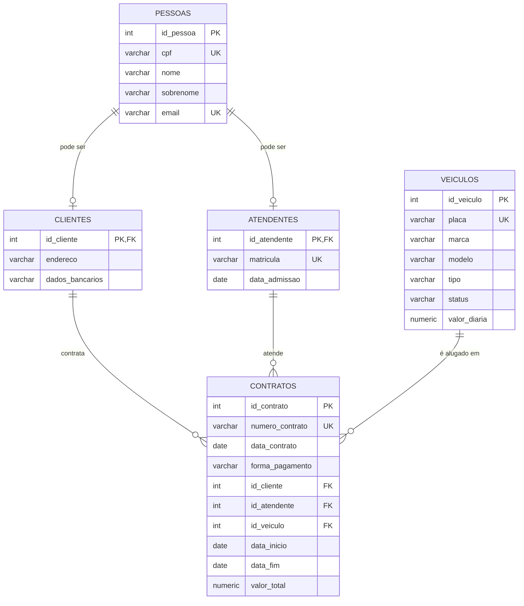

# Aluguel de Carros — Projeto de Banco de Dados (PostgreSQL)

## 1. Apresentação do projeto

**Tema:** Aluguel de Carros

**Objetivo geral:** desenvolver o banco de dados relacional de um sistema de locação de veículos voltado a motoristas de aplicativo. O sistema controla a frota (motos, carros de passeio e caminhões), os clientes que alugam os veículos, os atendentes que fecham os contratos e os próprios contratos de locação, com sua forma de pagamento e período de vigência.

**Público-alvo:** empresas de locação de veículos que atendem motoristas de aplicativos de transporte/entrega, e que precisam controlar disponibilidade da frota, histórico de contratos e dados de clientes e atendentes — inclusive quando uma mesma pessoa acumula os dois papéis.

## 2. Modelagem — Diagrama Entidade-Relacionamento

Decisão de modelagem: o enunciado exige que **atendentes também possam ser clientes**. Para não duplicar CPF, nome e e-mail em duas tabelas independentes, foi utilizada **especialização** (generalização/especialização): `pessoas` é a superclasse com os dados comuns, e `clientes`/`atendentes` são subclasses. Cada uma possui uma chave primária compartilhada com `pessoas`, representando um relacionamento 1:1 opcional.

Uma pessoa pode ter registro somente em `clientes`, somente em `atendentes`, nos dois ou em nenhum dos dois.



### Outras decisões de design

| Decisão                                                                        | Justificativa                                                                                                                                     |
| ------------------------------------------------------------------------------ | ------------------------------------------------------------------------------------------------------------------------------------------------- |
| `tipo` de veículo e `forma_pagamento` como `CHECK` em vez de tabela de domínio | São poucos valores, fixos e pouco prováveis de mudar — o `CHECK` já garante integridade sem exigir `JOIN` extra em toda consulta.                 |
| `status` do veículo (`DISPONIVEL` / `ALUGADO` / `MANUTENCAO`)                  | Não estava explícito no enunciado, mas é necessário para o sistema saber quais veículos podem ser alugados — demonstrado nos scripts de `UPDATE`. |
| `contratos.id_atendente` como `NOT NULL`                                       | Assunção de negócio: todo contrato é fechado por um atendente da empresa.                                                                         |
| `ON DELETE CASCADE` de `clientes`/`atendentes` para `pessoas`                  | Se a pessoa é removida, os papéis dela deixam de existir junto.                                                                                   |
| `ON DELETE RESTRICT` de `contratos` para `clientes`/`atendentes`/`veiculos`    | Contrato é registro histórico: não pode desaparecer o cliente ou veículo de um contrato existente. Essa regra é validada no script `013`.         |
| `numero_contrato`, `cpf`, `email`, `placa` e `matricula` com `UNIQUE`          | São chaves de negócio que não podem se repetir, além da chave primária técnica (`SERIAL`).                                                        |

## 3. Estrutura do repositório

```text
.
├── README.md
└── scripts/
    ├── 001__create_table_pessoas.sql
    ├── 002__create_table_clientes.sql
    ├── 003__create_table_atendentes.sql
    ├── 004__create_table_veiculos.sql
    ├── 005__create_table_contratos.sql
    ├── 006__insert_into_pessoas.sql
    ├── 007__insert_into_clientes.sql
    ├── 008__insert_into_atendentes.sql
    ├── 009__insert_into_veiculos.sql
    ├── 010__insert_into_contratos.sql
    ├── 011__update_veiculos_status.sql
    ├── 012__update_contratos_forma_pagamento.sql
    ├── 013__delete_from_contratos.sql
    └── 014__create_view_pessoas_atendentes.sql
```

Convenção de nomes: `[versão]__[ação]_[descrição/objeto].sql`.

Os scripts de criação e inserção foram estruturados para permitir reexecução sem duplicação de objetos ou dados, utilizando recursos como `CREATE TABLE IF NOT EXISTS`, `CREATE OR REPLACE VIEW` e `INSERT ... ON CONFLICT DO NOTHING`.

## 4. Como executar

### Pelo pgAdmin

1. Crie ou selecione o banco de dados `aluguel_carros`.
2. Abra o **Query Tool** do banco.
3. Execute os scripts da pasta `scripts` na ordem numérica indicada.
4. Após a execução, verifique as tabelas, os dados e a view criada.

### Pelo terminal

```bash
# 1) Criar o banco
createdb aluguel_carros

# 2) Rodar os scripts em ordem
for f in scripts/*.sql; do
    psql -d aluguel_carros -f "$f"
done
```

Também é possível executar os arquivos individualmente:

```bash
psql -d aluguel_carros -f scripts/001__create_table_pessoas.sql
```

e seguir a ordem numérica dos demais scripts.

## 5. O que cada fase de scripts demonstra

* **001–005 (DDL):** criação das 5 tabelas, com chaves primárias, estrangeiras, `UNIQUE`, `NOT NULL` e `CHECK`.

* **006–010 (DML - INSERT):** carga de dados de exemplo cobrindo todos os relacionamentos, incluindo uma pessoa (Juliana Pereira) que é **cliente e atendente** ao mesmo tempo.

* **011–012 (DML - UPDATE):** atualização do status do veículo após o vencimento do contrato e alteração pontual da forma de pagamento de um contrato.

* **013 (DML - DELETE):** exclusão de um registro de teste e validação de que a restrição `ON DELETE RESTRICT` impede a exclusão de um cliente que possui contrato relacionado.

* **014 (extra):** criação da view `vw_pessoas_papeis`, que lista cada pessoa indicando se ela é cliente, atendente ou ambos.
